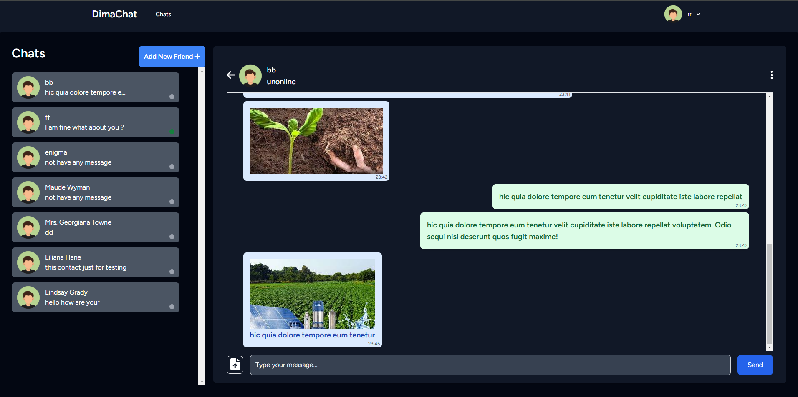
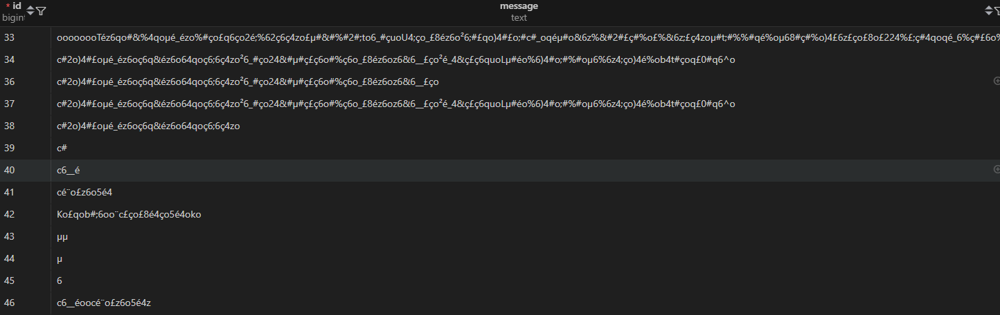

# DimaChat - Real-time Chat Application

DimaChat is a real-time chat application built with Laravel, Laravel Breeze, Inertia.js, React, Tailwind CSS, Laravel Echo, and Pusher. This application allows users to send and receive messages instantly, making it a perfect solution for real-time communication.


## Features

-   **Real-time messaging**: Thanks to Laravel Echo and Pusher, the app supports real-time communication between users.
-   **User authentication**: Implemented using Laravel Breeze for a quick and simple user registration and login system.
-   **React-based frontend**: The user interface is built using React and Inertia.js to provide a smooth and modern single-page application (SPA) experience.
-   **Beautiful UI**: Tailwind CSS is used for building a responsive and modern UI with minimal effort.
-   **Secure**: The app uses Laravel's built-in authentication features and broadcasts events securely with Laravel Echo.



## Tech Stack

-   **Backend**: Laravel 11.x
-   **Frontend**: React.js with Inertia.js
-   **Realtime Broadcasting**: Laravel Echo, Pusher
-   **UI**: Tailwind CSS
-   **Authentication**: Laravel Breeze

## Installation

Follow these steps to set up DimaChat on your local machine.

### Prerequisites

Make sure you have the following installed:

-   [PHP 8.x or higher](https://www.php.net/)
-   [Composer](https://getcomposer.org/)
-   [Node.js and npm](https://nodejs.org/)
-   [Laravel](https://laravel.com/docs/10.x) installed globally (optional)
-   [Redis](https://redis.io/) (for broadcasting with Laravel Echo)
-   [Pusher](https://pusher.com/) (for WebSocket broadcasting)

### Step 1: Clone the Repository

```bash
git clone https://github.com/Elmahdijaouali/chat-app
cd chat-app

composer install
``
### Step 2: Run project

```bash

php artisan serve
php artisan reverb:start
php artisan queue:listen
npm run dev

```
